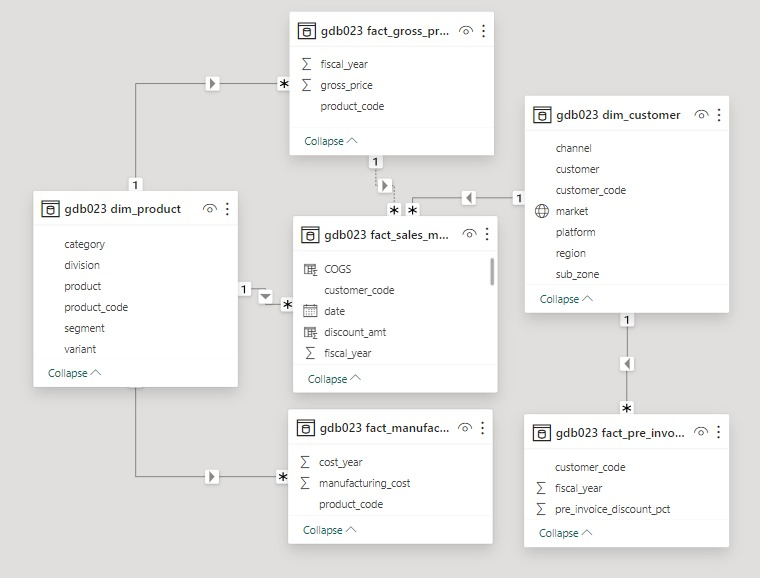
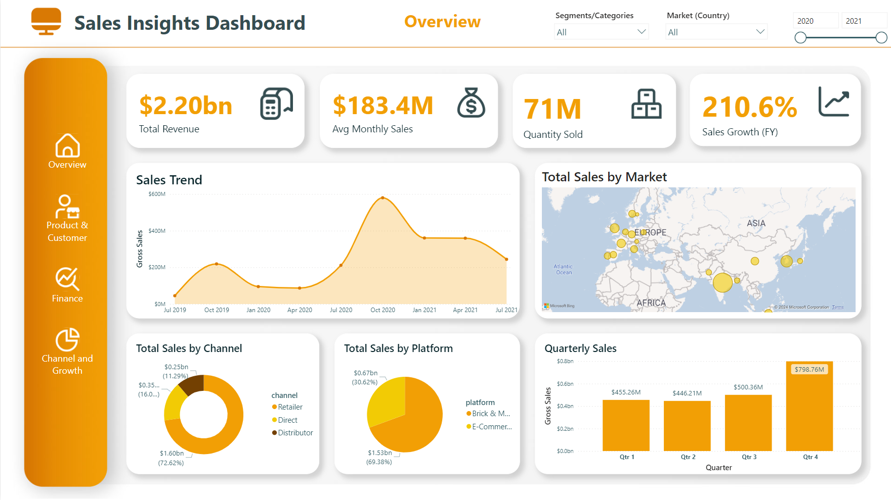

# Computer Hardware Company Sales Data Analytics
This is an end-to-end data analytics project in which a real business problem is solved using SQL (to perform ad hoc requests for which the business needs insights) and Power BI, to develop a dashboard for top-level management for real time monitoring.

## Tools:
- SQL
- MySQL Database
- Power BI

## Objectives
- Providing insights for ad-hoc business questions and requests by the client.
- Dashboard for monitoring and tracking sales performance.

## Steps Performed
- Accessed database and executed SQL queries to get insights for client's ad-hoc requests and questions.
- Connected MySQL database with PowerBI.
- Did data transformation and cleaning with Power Query.
- Loaded the data.
- Created Data Model with Dimensions and fact tables.
- Developed and published dashboard for real-time monitoring and tracking sales performance.

## Insights from Ah-hoc requests:
For SQL queries go to queries folder.

## Data Model

## Dashboard

Live Dashboard: <a href="https://app.powerbi.com/view?r=eyJrIjoiYzRmMTNhYzgtMzU0ZS00ZjE3LTk2ZDUtMGRkMjEyNjYwODExIiwidCI6ImRmODY3OWNkLWE4MGUtNDVkOC05OWFjLWM4M2VkN2ZmOTVhMCJ9">Click Here</a>

