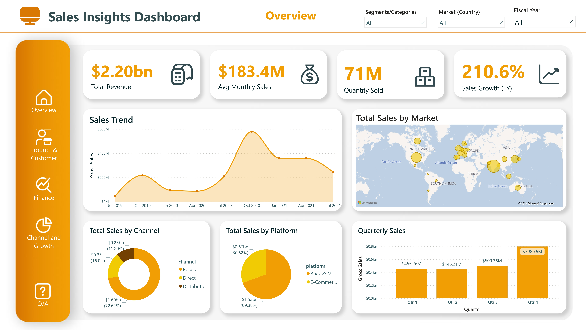

# Computer Hardware Company Sales Data Analytics
Analyzing the dataset of a telecom company to track it's important KPIs, compare post and pre 5G launch performance and performing market competition analysis to provide insights to the executives in the telecom domain using Power BI.

## Problem Statement: 
Our client is one of the leading computer hardware producers and well expanded in many countries. However, the management noticed that they do not get enough insights to make quick and smart data-informed decisions. They want to expand their data analytics work by adding a data analyst in their team. Their data analytics director wanted to hire someone who can provide insights to ad-hoc requests and business questions and create dashboards and reports for monitoring their business performance.

## Tools:
- SQL
- MySQL Database
- Power BI

## Objectives
- Providing insights to ad-hoc business questions and requests by the client.
- Dashboard for monitoring and tracking sales performance.

## Steps Performed
- Accessed database and executed SQL queries to get insights for client's ad-hoc requests and questions.
- Connected MySQL database with PowerBI.
- Did data transformation and cleaning with Power Query.
- Loaded the data.
- Created Data Model with Dimensions and fact tables.
- Developed and published dashboard for real-time monitoring and tracking sales performance.

## Insights from Ah-hoc requests:
For SQL queries go to queries folder.

## Data Model

## Dashboard

Live Dashboard: <a href="https://app.powerbi.com/view?r=eyJrIjoiYzRmMTNhYzgtMzU0ZS00ZjE3LTk2ZDUtMGRkMjEyNjYwODExIiwidCI6ImRmODY3OWNkLWE4MGUtNDVkOC05OWFjLWM4M2VkN2ZmOTVhMCJ9">Click Here</a>

